# Secure, Automated Software Supply Chain

Creating a Secure Supply Chain of images is vitally important. Every organization needs to weigh ALL options available and understand the security risks. Having so many options for images makes it difficult to pick the right ones. Ultimately every organization needs to know the provenance of all the images, even when trusting an upstream image from [store.docker.com](http://store.docker.com). Once the images are imported into the infrastructure, a vulnerability scan is vital. Docker Trusted Registry with Image Scanning gives insight into any vulnerabilities. Finally, everything needs to be automated with Jenkins to provide a succinct audit trail.

## What You Will Learn
This post describes the components that make up a Secure Supply Chain. Topics include using Git, Jenkins, and [the Docker Store](http://store.docker.com) to feed the supply chain. All the tools listed and demonstrated within this reference architecture can be replaced with alternatives.

The Secure Supply Chain can be broken into three stages:

- Stage 1 is a code repository.
- Stage 2 is Continuous Integration.
- Stage 3 is a registry that can scan images.

Even though there are many alternatives, this document focuses on one set:

- Github (Code Stage 1)
- Jenkins (Build Automation Stage 2)
- Docker Trusted Registry (Scanning and Promotion Stage 3)

One motto to remember for this reference architecture is "NO human will build or deploy code to production!"

## Abbreviations
The following abbreviations are used in this document:

* UCP = [Universal Control Plane](https://docs.docker.com/ee/ucp/)
* DTR = [Docker Trusted Registry](https://docs.docker.com/ee/dtr/)
* DCT = [Docker Content Trust](https://docs.docker.com/engine/security/trust/content_trust/)
* EE = [Docker Enterprise Edition](https://docs.docker.com/ee/)
* CVE = [Common Vulnerabilities and Exposures](https://cve.mitre.org/)
* PWD = [Play with Docker](https://ee-labs.play-with-docker.com)

## Why
There are several good reasons why you need a **Secure Supply Chain**. Creating a **Secure Supply Chain** is theoretically mandatory for production. Non-production pipelines can also take advantage of having an automated base image. When thinking about a Supply Chain, a couple of key phrases come to mind:

* "NO human will build or deploy code to production!"
   * It helps prevent malicious code from being snuck into approved code. It also helps prevent insider threat.
* "Everything needs an audit trail."
   * Being able to prove the what, when, why, and how questions makes everyone's job easier.
* "Every supply chain needs a known good source."
   * Would you build a house in the middle of a swamp?

Ideally you want the shortest path for images. You want to guarantee the success of the image making it through the supply chain. Limiting the steps is a great way to reduce the number of moving parts.

## Before we Begin
Before we begin we are going to assume you have already tried out [Docker Enterprise Edition - for Centos](https://store.docker.com/editions/enterprise/docker-ee-server-centos). More importantly you have setup [Docker Trusted Registry](https://docs.docker.com/ee/dtr/). Let's assume you have already set this up.

## Create a Jenkins User and Organization
In order to setup our automation we need to create an organization and user account for Jenkins. We are going to create a user named `jenkins` in the organization `ci`.

### Create a Jenkins Organization
1. From the `PWD` main page click on `DTR`.

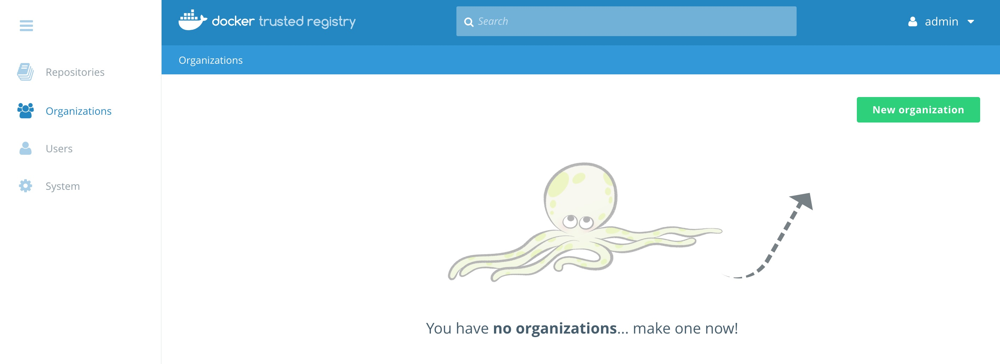

2. Once in `DTR` navigate to `Organizations` on the left.
3. Now click `New organization`.
4. Type in `ci` and click `Save`.

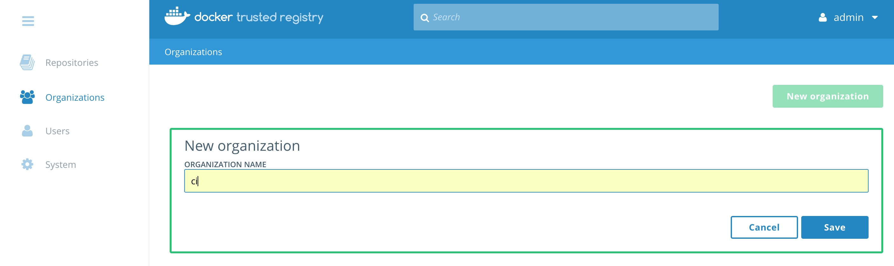

Now we should see the organization named `ci`.

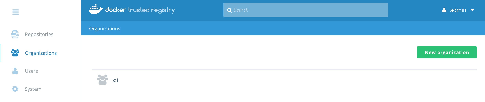

### Create Jenkins User
While remaining in DTR we can create the user from here.

1. Click on the organization `ci`.
2. Click `Add user`.
3. Make sure you click the radio button `New`. Add a new user name `jenkins`. Set a simple password that you can remember. Maybe `admin1234`?

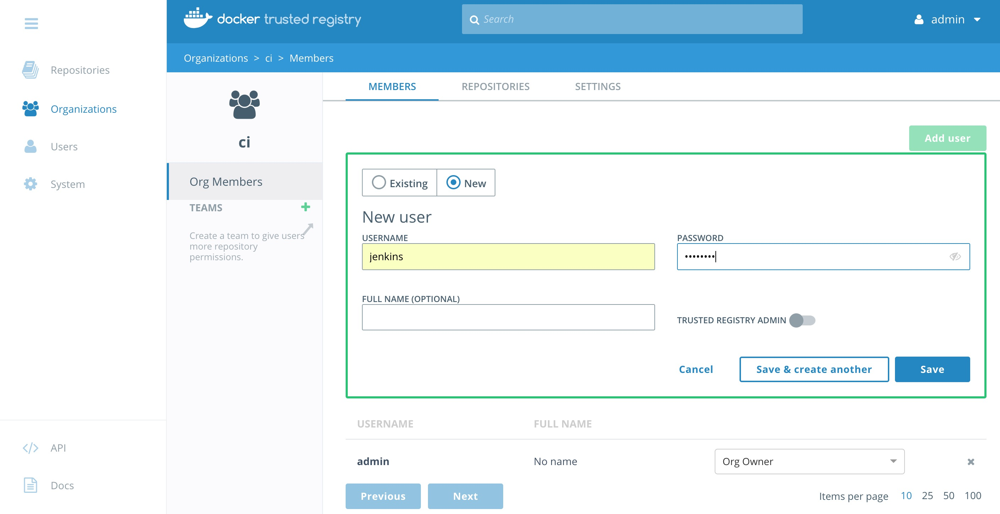

Now change the permissions for the `jenkins` account to `Org Owner`.

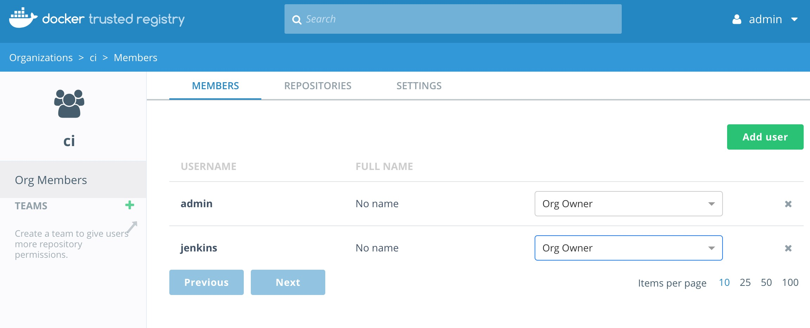

### Create Jenkins DTR Token
Now that we have the `jenkins` user created we need to add a token for use with DTR's API.

Navigate to `Users` on the left pane. Click on `jenkins`, then click the `Access Tokens` tab.

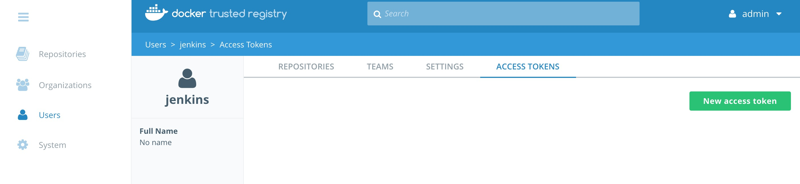

Click `New access token`. Enter `api` into the description field and click `Create`.

**Write down the token that is displayed. You will need this again!**

It should look like `ee9d7ff2-6fd4-4a41-9971-789e06e0d5d5`. Click `Done`.

## Create DTR Repository
We now need to access Docker Trusted Registry to setup two repositories.

We have an easy way with a script or the hard way by using the GUI.

Either way we need to create two repositories, `dc18_build` and `dc18`. `dc18_build` will be used for the private version of the image. `dc18` will be the public version once an CVE scan is complete.

1. Navigate to `Repositories` on the left menu and click `New repository`.
2. Create a repository that looks like `ci`/`dc18_build`. Make sure you click `Private`. **Do not click `Create` yet!**
3. Click `Show advanced settings` and then click `On Push` under `SCAN ON PUSH`.  This will ensure that the CVE scan will start right after every push to this repository.  Turn on `IMMUTABILITY ` to ensure tags cannot be overwritten. Then click `Create`.

   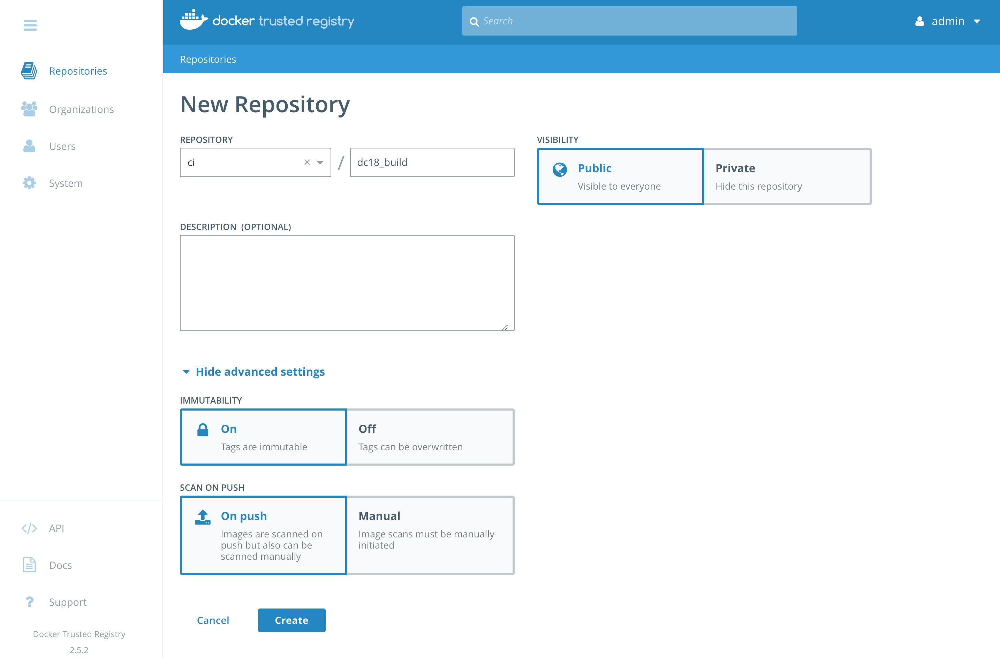

4. Repeat this for creating the `ci`/`dc18` repository with `VISIBILITY` set to `Public` and `SCAN ON PUSH` set to `On Push`.
5. We should have two repositories now.

    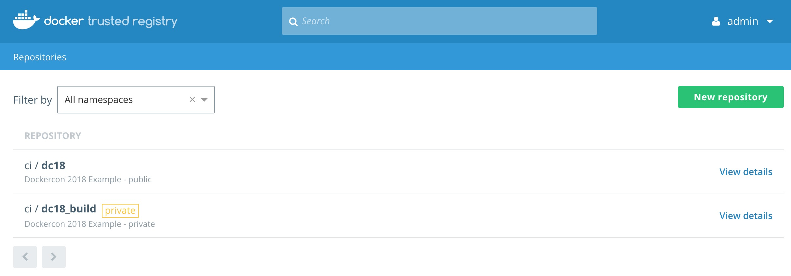

### Create Promotion Policy - Private to Public
With the two repositories setup we can now define the [promotion policy](https://docs.docker.com/ee/dtr/user/promotion-policies/). The first policy we are going to create is for promoting an image that has passed a scan with zero (0) **Critical** vulnerabilities. This policy will target the `ci`/`dc_18` private repository.

1. Navigate to the `ci`/`dc18_build` repository. Click `Promotions` and click `New promotion policy`.

  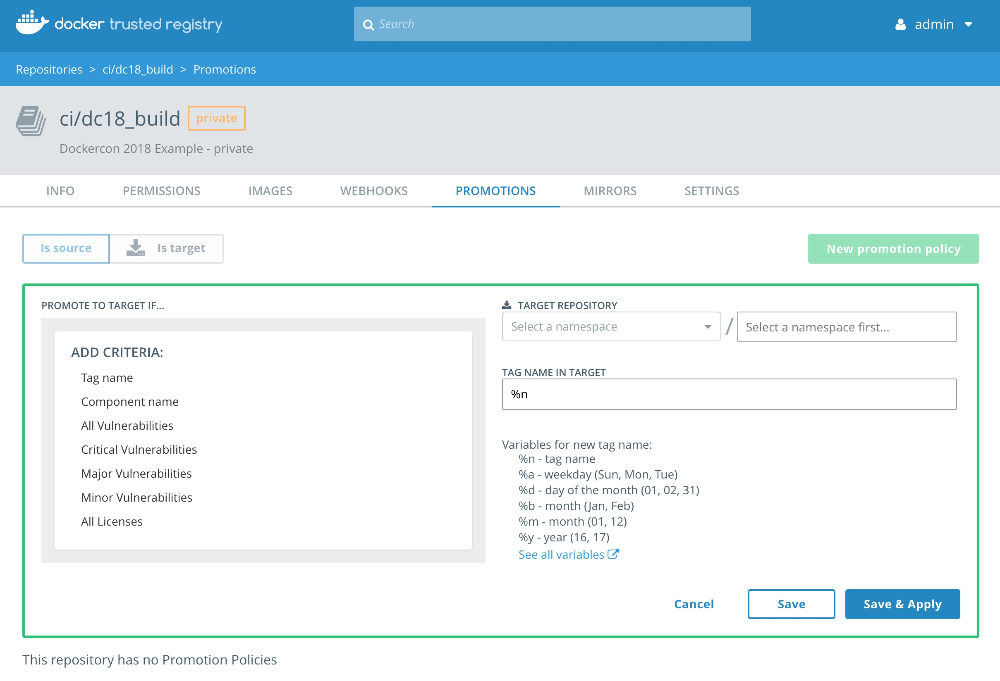

2. In the `PROMOTE TO TARGET IF...` box select `Critical Vulnerabilities` and then check `equals`. In the box below `equals` enter the number zero (0) and click `Add`.
3. Set the `TARGET REPOSITORY` to `ci`/`dc18` and click `Save & Apply`.

  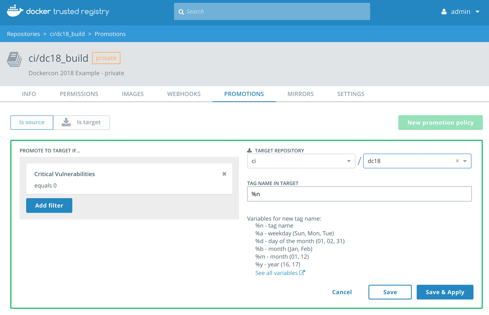

When we push an image to `ci`/`dc18_build` it will get scanned. Based on that scan result we could see the image moved to `ci`/`dc18`. Lets push a few images to see if it worked.

## Pull / Tag / Push Docker Image
Lets pull, tag, and push a few images to YOUR DTR.

On any linux system with Docker installed.

1. In the console create a variable called `DTR_URL`.

	```
	export DTR_URL=<URL FOR YOUR DTR>
	```

4. Now we can `docker login` to our DTR server using your `DTR_TOKEN`.

	```
	docker login -u jenkins -p $DTR_TOKEN $DTR_URL
	```

5. Now we can `docker image pull` a few images.

	  ```
	docker image pull clemenko/dc18:0.1
	docker image pull clemenko/dc18:0.2
	docker image pull clemenko/dc18:0.3
	docker image pull alpine
	  ```

  This command is pull a few images from [hub.docker.com](https://hub.docker.com).

6. Now let's `docker image tag` the image for our DTR instance. We will use the `DTR_URL` variable we set before.

	```
	docker image tag clemenko/dc18:0.1 $DTR_URL/ci/dc18_build:0.1
	docker image tag clemenko/dc18:0.2 $DTR_URL/ci/dc18_build:0.2
	docker image tag clemenko/dc18:0.3 $DTR_URL/ci/dc18_build:0.3
	docker image tag alpine $DTR_URL/ci/dc18_build:alpine
	 ```

7. Now we can `docker image push` the images to DTR.

	```
	docker image push $DTR_URL/ci/dc18_build:0.1
	docker image push $DTR_URL/ci/dc18_build:0.2
	docker image push $DTR_URL/ci/dc18_build:0.3
	docker image push $DTR_URL/ci/dc18_build:alpine
	```

## Review Scan Results
Lets take a good look at the scan results from the images. **Please keep in mind this will take a few minutes to complete.**

1. Navigate to DTR --> `Repostories` --> `ci/dc18_build` --> `Images`.

	Do not worry if you see images in a `Scanning...` or `Pending` state. Please click to another tab and click back.

    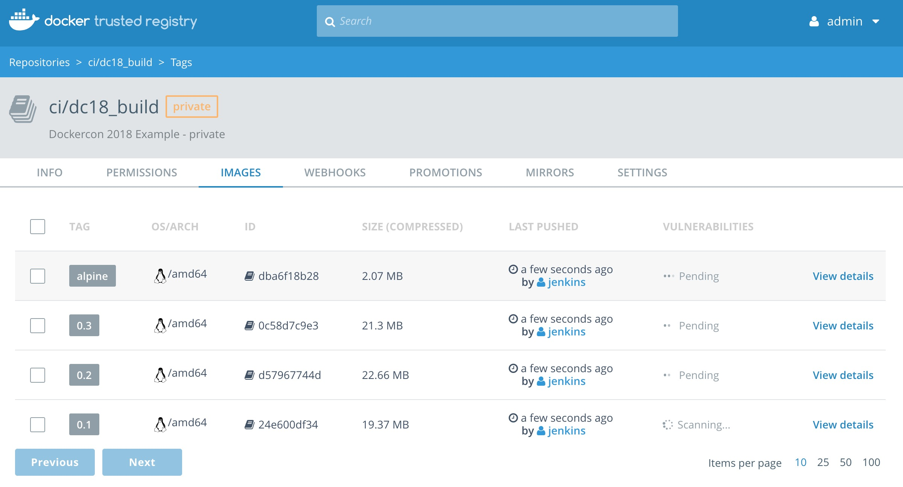

2. Take a look at the details to see exactly what piece of the image is vulnerable.

     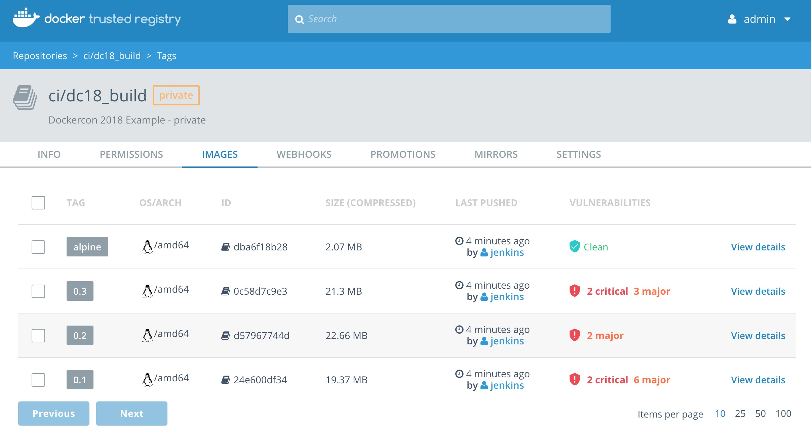

     Click `View details` for an image that has vulnerabilities. How about `0.2`? There are two views for the scanning results, **Layers** and **Components**. The **Layers** view lists the layers of the image in order as they are built by the Dockerfile and shows which layer of the image had the vulnerable binary. This is extremely useful when diagnosing where the vulnerability is in the Dockerfile.

     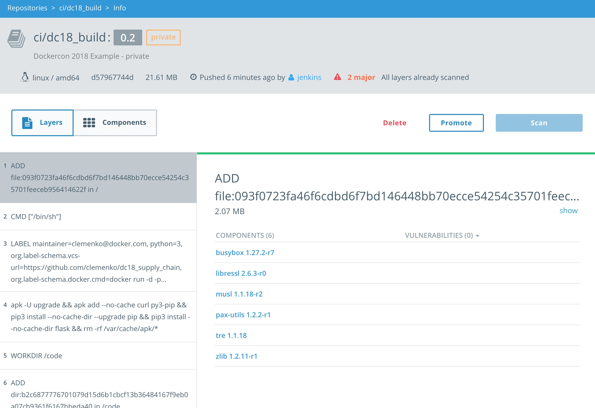

    The vulnerable binary(s) are displayed, along with all the other contents of the layer, when you click on a layer. In this example there are a few potentially vulnerable binaries - you can click on a component to switch to the **Component view** and get more details about the specific item:

    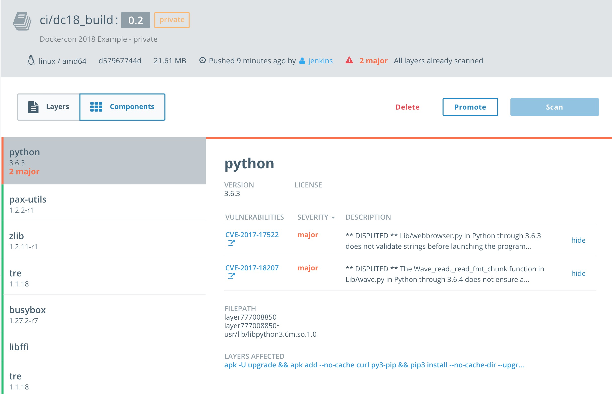

    The **Components view** lists the individual component libraries indexed by the scanning system, in order of severity and number of vulnerabilities found, most vulnerable first.

    Now we have a chance to review each vulnerability by clicking the CVE itself, example `CVE-2017-17522`. This will direct you to Mitre's site for CVEs.

    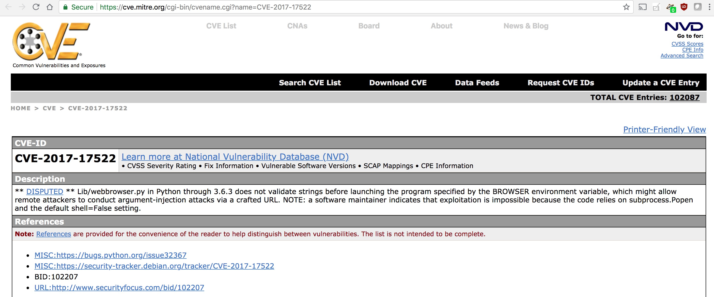

    Now that we know what is in the image. We should probably act upon it.

### Hide Vulnerabilities
If we find that a CVE is a false positive, meaning that it might be disputed  or from an OS that you are not using. If this is the case we can simply `hide` the vulnerability for that image. This will not remove the fact that the CVE was hidden - if this vulnerability shows up in other images, it is still reported.

Click `hide` for the two CVEs.
	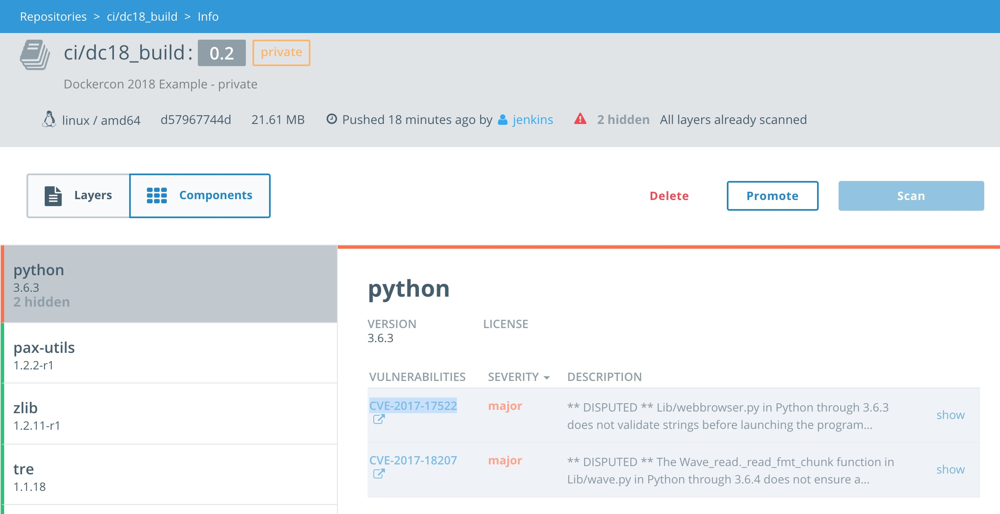

If we click back to `Images` we can now see that the image is clean.
	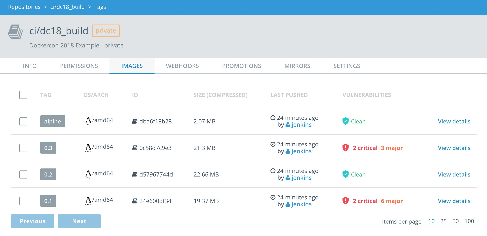

Once we have hidden some CVEs we might want to perform a manual promotion of the image.


##  Docker Content Trust / Image Signing
Docker Content Trust/Notary provides a cryptographic signature for each image. The signature provides security so that the image requested is the image you get. Read [Notary's Architecture](https://docs.docker.com/notary/service_architecture/) to learn more about how Notary is secure. Since Docker EE is "Secure by Default," Docker Trusted Registry comes with the Notary server out of the box.

We can create policy enforcement within Universal Control Plane (UCP) such that **ONLY** signed images from the `ci` team will be allowed to run. Since this workshop is about DTR and Secure Supply Chain we will skip that step.

Let's sign our first Docker image?

1. Right now you should have a promoted image `$DTR_URL/ci/dc18:promoted`. We need to tag it with a new `signed` tag.

   ```
   docker image tag $DTR_URL/ci/dc18:promoted $DTR_URL/ci/dc18:signed
   ```

2. Now lets enable DCT.

    ```
    export DOCKER_CONTENT_TRUST=1
    ```

3. And push... It will ask you for a BUNCH of passwords. Do yourself a favor and use the same password as the login.

    ```
    docker image push $DTR_URL/ci/dc18:signed
    ```

    Here is an example output:

	```
	[worker3] (local) root@10.20.0.32 ~/dc18_supply_chain
	$ docker image push $DTR_URL/ci/dc18:signed
	The push refers to a repository [dtr.dockr.life/ci/dc18]
	cd7100a72410: Mounted from ci/dc18
	signed: digest: sha256:8c03bb07a531c53ad7d0f6e7041b64d81f99c6e493cb39abba56d956b40eacbc size: 528
	Signing and pushing trust metadata
	You are about to create a new root signing key passphrase. This passphrase
	will be used to protect the most sensitive key in your signing system. Please
	choose a long, complex passphrase and be careful to keep the password and the
	key file itself secure and backed up. It is highly recommended that you use a
	password manager to generate the passphrase and keep it safe. There will be no
	way to recover this key. You can find the key in your config directory.
	Enter passphrase for new root key with ID baf4f85:
	Repeat passphrase for new root key with ID baf4f85:
	Enter passphrase for new repository key with ID 8688152 (dtr.dockr.life/ci/dc18):
	Repeat passphrase for new repository key with ID 8688152 (dtr.dockr.life/ci/dc18):
	Finished initializing "dtr.dockr.life/ci/dc18"
	Successfully signed "dtr.dockr.life/ci/dc18":signed
	```

Again please use the same password. It will simplify this part.

## Automate with Jenkins
In order to automate we need to deploy Jenkins. There are many ways to deploy Jenkins. Here is a simple way of using Docker to deploy Jenkins.

### Build Jenkins with Docker installed

We will need the docker client binary in our Jenkins container to issue the docker commands. Here is a [simple Dockerfile](https://github.com/clemenko/jenkinsworld2018/blob/master/jenkins-nginx/jenkins.Dockerfile) which will add the docker binary into our final Jenkins image:

```
FROM alpine as build
RUN apk -U add docker

FROM jenkins/jenkins:lts-alpine
LABEL maintainer="clemenko@docker.com", \
      org.label-schema.vcs-url="https://github.com/clemenko/jenkinsworld2018/", \
      org.label-schema.docker.cmd="docker run -d -v /var/run/docker.sock:/var/run/docker.sock -v /jenkins/:/var/jenkins_home -v /jenkins/.ssh:/root/.ssh/ -p 8080:8080 -p 50000:50000 --name jenkins superjenkins"
USER root
RUN apk -U add libltdl && rm -rf /var/cache/apk/*
COPY --from=build /usr/bin/docker /usr/bin/
```
At a high level we are going to use Jenkins without any plugins. In your organization you will probably want to add the `GIT` and other plugins to extend the functionality. We can demonstrate everything with basic shell scripts.

### Deploy Jenkins

1. Let's use a [script](https://github.com/clemenko/jenkinsworld2018/blob/master/scripts/jenkins.sh) for deploying Jenkins as a container that will output the Jenkins initial password.

   ```
   #!/bin/bash

   jenkins_id=$(docker run -d -p 8080:8080 -v /var/run/docker.sock:/var/run/docker.sock clemenko/dc18:jenkins)
   echo $jenkins_id > jenkins.id

   echo -n "  Waiting for Jenkins to start."
   for i in {1..20}; do echo -n "."; sleep 1; done
   echo ""

   echo "========================================================================================================="
   echo ""
   echo "  Jenkins Setup Password = "$(docker exec $jenkins_id cat /var/jenkins_home/secrets/initialAdminPassword)
   echo ""
   echo "========================================================================================================="
   ```

4. From a browser navigate to your host on port 8080. Let's start the setup of Jenkins and enter the password. It may take a minute or two for the `Unlock Jenkins` page to load. Be patient.
	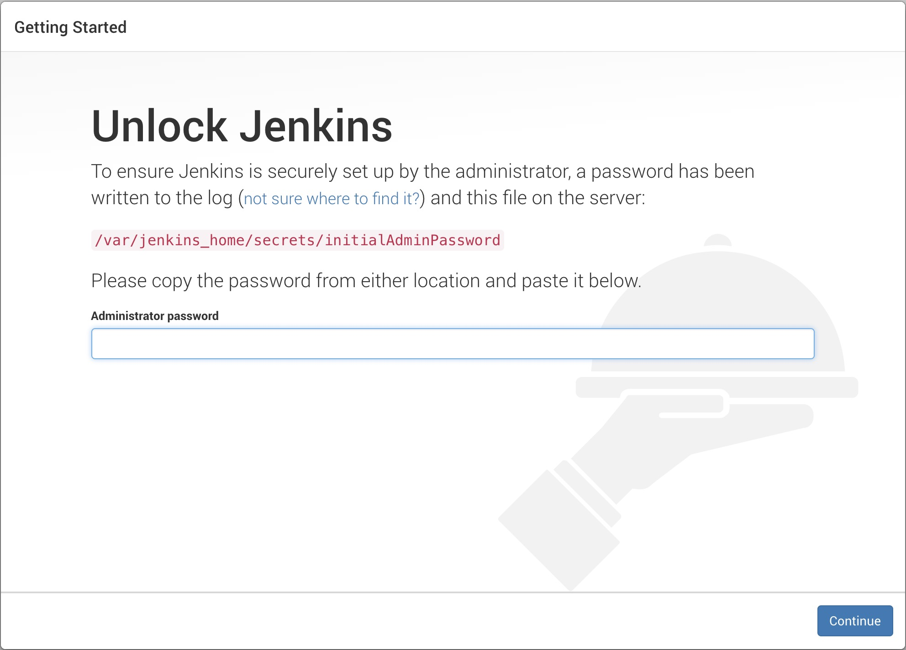

5. Click `Select plugins to install`.
	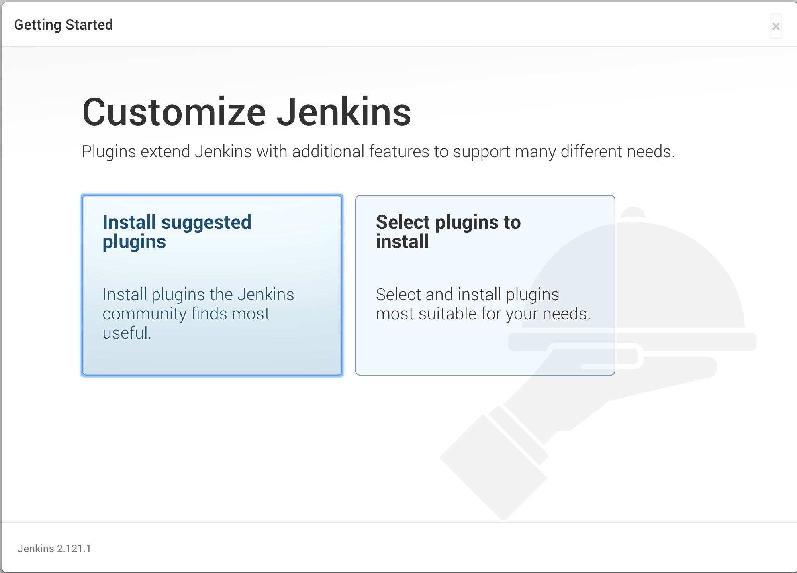

6. We don't need to install **ANY** plugins. Click `none` at the top.
	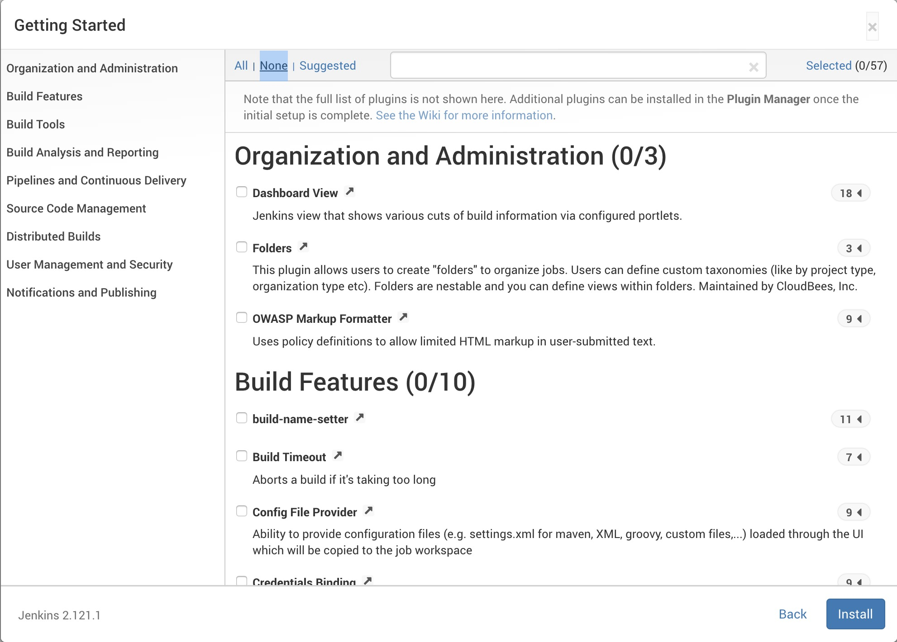

7. Next Click `Continue as admin` in the lower right hand corner. We don't need to create another username for Jenkins.
	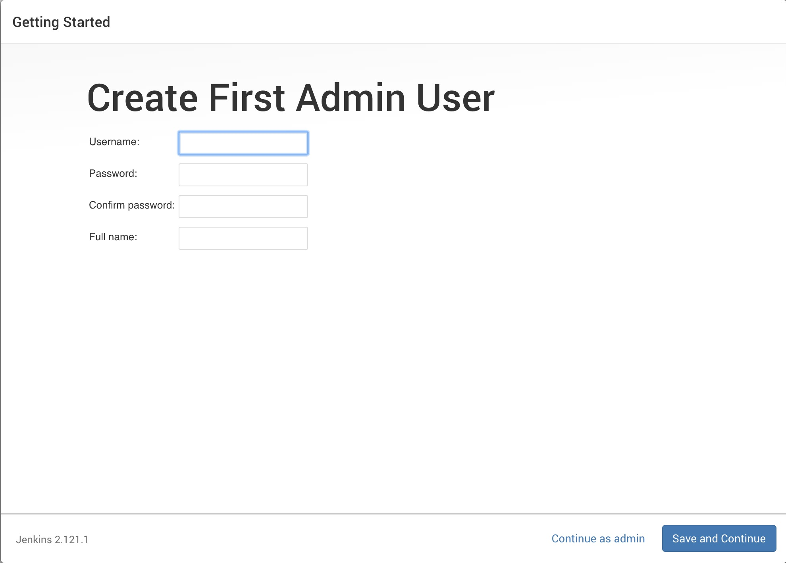

8. Next for Instance Configuration click `Save and Finish`.
	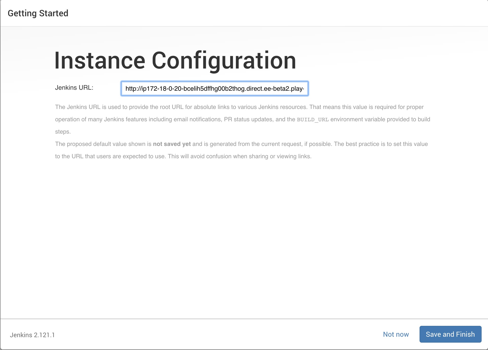

9. And we are done installing Jenkins. Click `Start using Jenkins`
	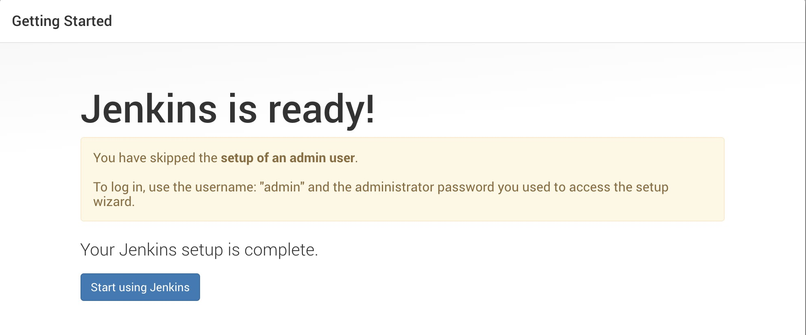


### Plumb Jenkins
Now that we have Jenkins setup and running we can create our first "Item" or job.

1. Click on `New item` in the upper left.
	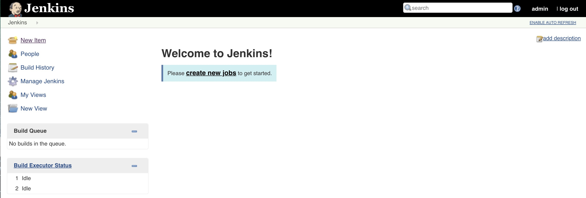

2. Since we didn't install any plugins we should only see a `Freestyle project`. Enter a name like `ci_dc18`, click `Freestyle project` and then click `OK`.
	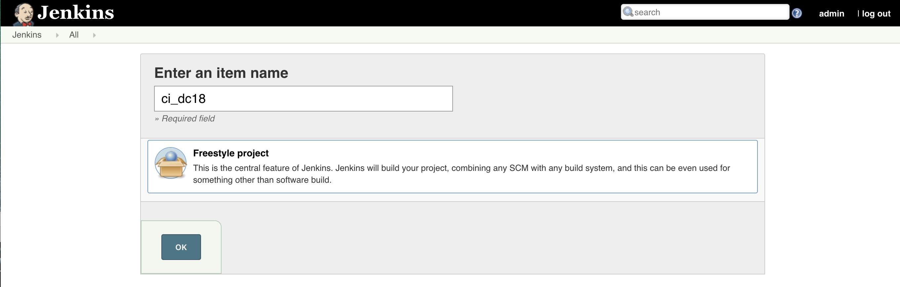

3. Let's scroll down to the `Build` section. We will come back to the `Build Triggers` section in a bit. Now click `Add build step` --> `Execute shell`.
	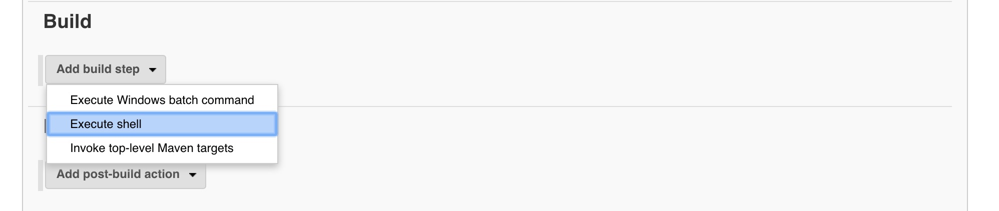

4. You will now see a text box. Past the following build script into the text box.

	**Please replace the <DTR_URL> with your URL!**

	```
	DTR_USERNAME=admin
	DTR_URL=<DTR_URL>

	docker login -u admin -p admin1234 $DTR_URL

	docker image pull clemenko/dc18:0.2

	docker image tag clemenko/dc18:0.2 $DTR_URL/ci/dc18_build:jenkins_$BUILD_NUMBER

	docker image push $DTR_URL/ci/dc18_build:jenkins_$BUILD_NUMBER

	docker rmi clemenko/dc18:0.1 clemenko/dc18:0.2 $DTR_URL/ci/dc18_build:jenkins_$BUILD_NUMBER
	```

  It will look very similar to:
	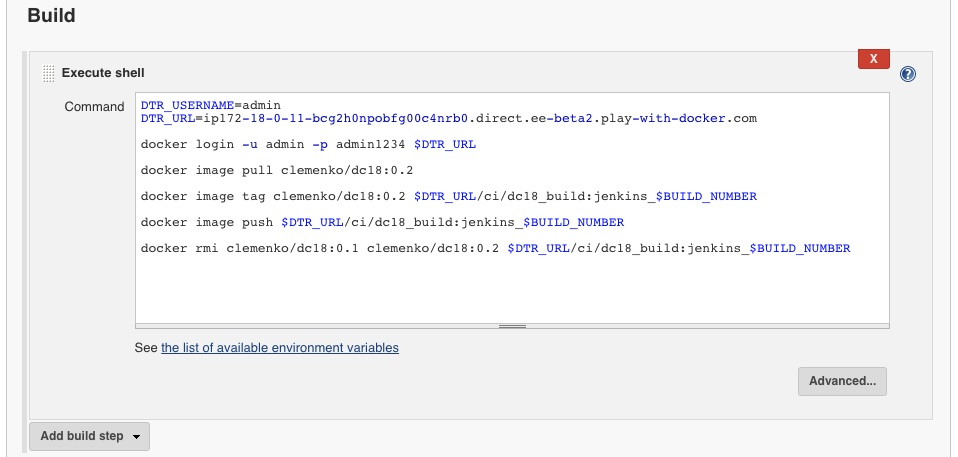

	Now scroll down and click `Save`.

5. Now let's run the build. Click `Build now`.
	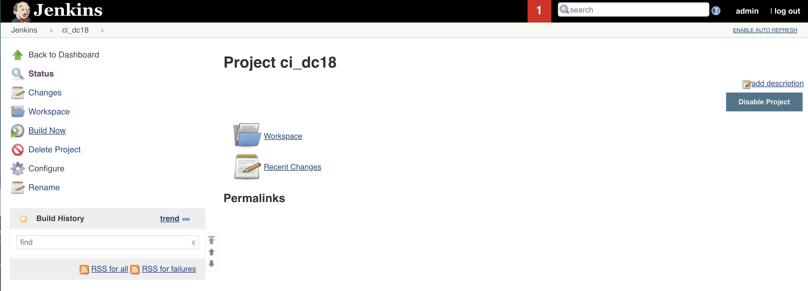

6. You can watch the output of the `Build` by clicking on the task number in the `Build History` and then selecting `Build Output`
	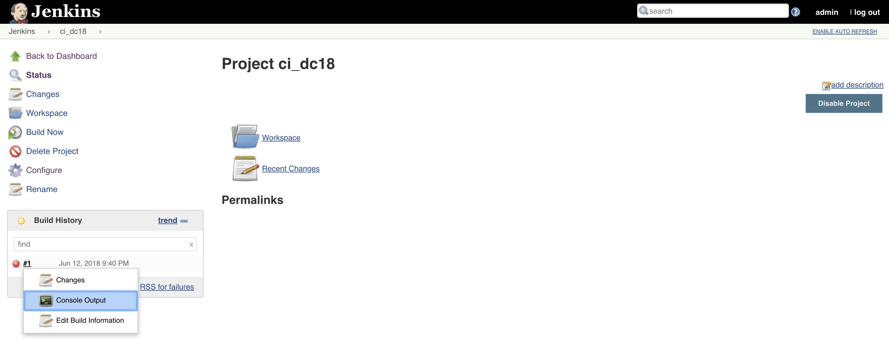

7. The console output will show you all the details from the script execution.
	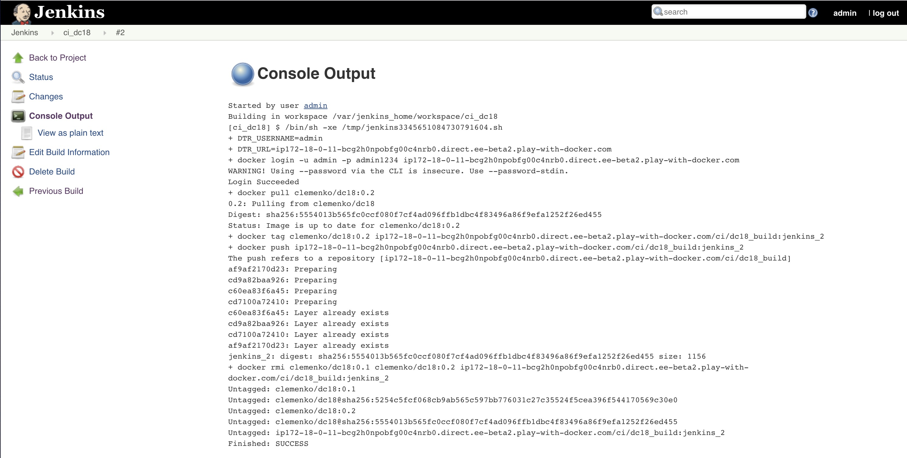

8. Review the `ci`/`dc18` repository in DTR. You should now see a bunch of tags that have been promoted.
	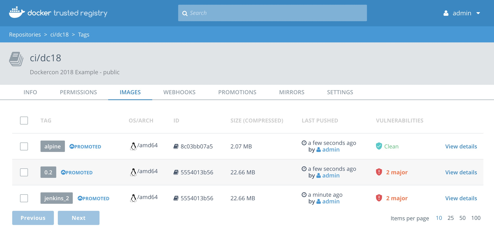

### Webhooks
Now that we have Jenkins setup we can extend it with webhooks. In Jenkins speak a webhook is simply a build trigger. Let's configure one.

1. Navigate to Jenkins and click on the project/item called `ci_dc18` and click on `Configure` on the left hand side.
	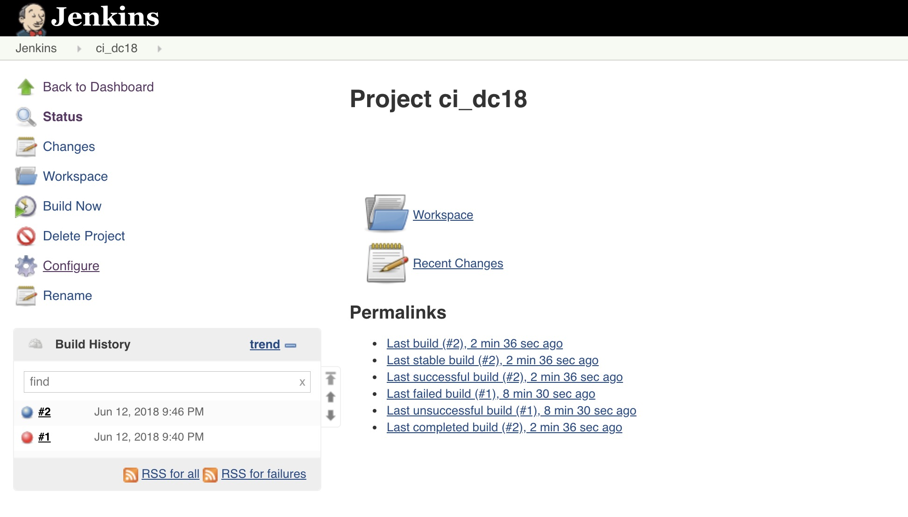

2. Then scroll down to `Build Triggers`. Check the radio button for `Trigger builds remotely` and enter an Authentication Token of `dc18_rocks`.  Scroll down and click `Save`.
	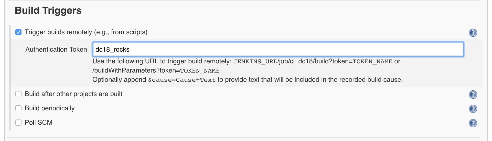

3. Now in your browser goto YOUR `http://<JENKINS URL>:8080/job/ci_dc18/build?token=dc18_rocks`

	It should look like: `http://<JENKINS URL>:8080/job/ci_dc18/build?token=dc18_rocks`

The webhook can now be used in DTR to automatically trigger the Jenkins job when a specific notification is received - see [Manage webhooks](https://docs.docker.com/ee/dtr/user/create-and-manage-webhooks/)

## Conclusion
In this post we were able to start to understand and deploy the basics of an Automated Secure Supply Chain. Hopefully with this foundation you can build your organizations Automated Secure Supply Chain!
